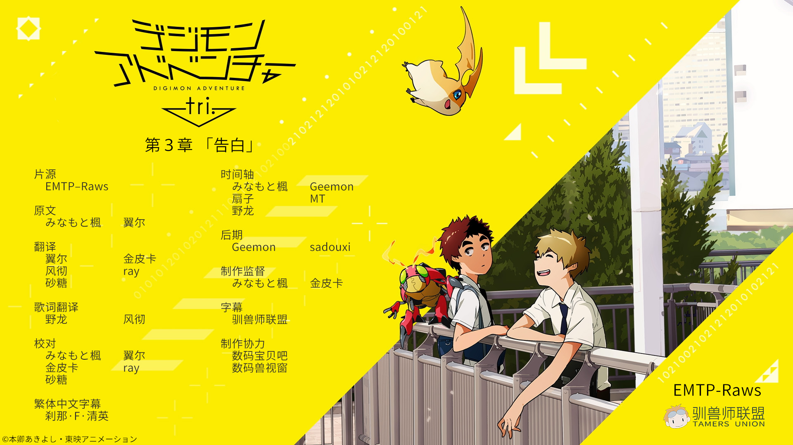

## 数码兽大冒险tri. 第3章「告白」

缅因猫兽突然发生变异，消灭了狮子兽，并进入了空间扭曲的那一边。因为它的消失，使得太一一行人无法掩饰内心的不安。面对这种状况，光子郎苦思着能否采取对策。但是并没有什么有效手段，光子郎希望能得到情报，开始追问芽心。芽心消沉着，什么都无法回答——为了防止感染，亚古兽它们被隔离在光子郎办公室里，但是巴达兽已经开始出现感染的征兆。同时亚古兽它们通过附身在小光体内的声音，被告知了有关数码世界的重大秘密。在与再次出现的缅因猫兽的战斗中，“那个时刻”已经到来。揭露出来的秘密使太一一行人苦恼不已。在各自交错着的想法之中，他们下定了某种决心…
现在，冒险再一次进化——

字幕所需字体：
- 微软雅黑
- Meiryo
- 方正准圆_GBK
- 等线
- 等线 Light