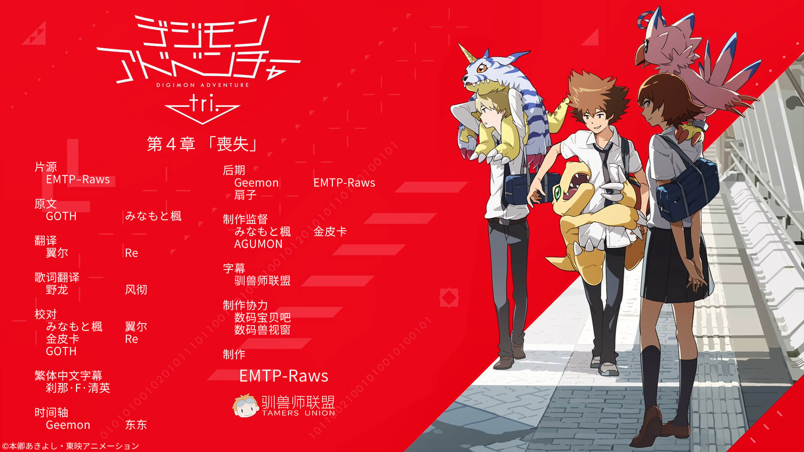

## 数码兽大冒险tri. 第4章「丧失」

缅因猫兽发生暴走，然后在这种情况下进行了重置。缅因猫兽的离开让芽心异常苦恼，太一他们则留下芽心再次来到了数码世界。在这里，他们和数码兽们重聚，但数码兽们已经失去了记忆。尽管如此，他们试图再次建立联系，太一他们向数码兽们伸出了友谊的双手，数码兽们也回应着。但是只有比丘兽进化到了成长期，而在成长期时却显露出了警惕心。武之内空向来是关心别人多于自己，比丘兽此时对她却产生了不信任感。受伤的空停下脚步，太一和大和都不知如何安慰她。
数码世界今后该怎么办呢？由此，大家进行了协商。这时，突然出现了缅因猫兽的身影，随后又消失了。它为什么会留着原来的记忆，一边流泪，一边寻找芽心。看着缅因猫兽的身影，大家坚定了要环游数码世界，拯救它的决心。但是，那个带走缅因猫兽的黑暗家伙又出现了。
就在此时，现实世界的西岛收到了姬川失踪的报道。他调查了姬川到现在为止所有行为，确认了她背后还隐瞒了某个目的。而这是连接着决定两人命运的过去所发生的事情……
现在，冒险再一次进化—— 

字幕所需字体：
- 微软雅黑
- Meiryo
- 方正准圆_GBK
- 等线
- 等线 Light
- 仿宋