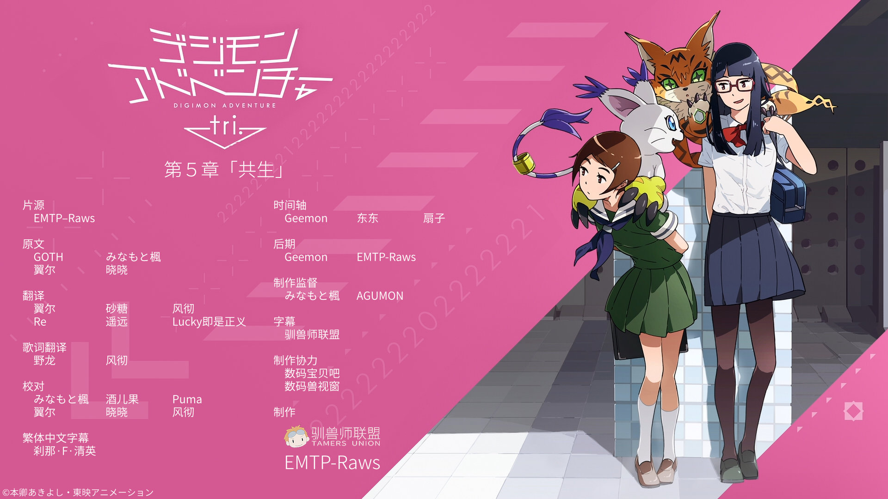

## 数码兽大冒险tri. 第5章「共生」

缅因猫兽眼睁睁地看着自己的伙伴，望月芽心被外表是玄内的不明男子伤害，再次暴走了。消失在现实世界的缅因猫兽就是扭曲本身。它拥有的力量过于强大，是毁灭世界的关键。哈克兽出现在西岛大吾和望月博士面前，说出了真相。恒常性自身想要保护世界的平衡，因而将现在过于强大的缅因猫兽视为威胁，想要清除它。
由于暴走的缅因猫兽出现，现实世界的崩坏开始进入倒计时。世界各处接二连三发生异变。数码兽们穿过扭曲，蓄势待发。被选召的孩子们被异变的数码世界排除在外，回到了现实世界。但是，因为与伙伴数码兽同行而面临人们的追捕。
正当被选召的孩子一行人孤立无援，拼命探索如何脱离困境时，芽心独自一人苦恼着。背负着无法承受的压力，她几近崩溃，连伙伴和数码兽的声音都听不到了。然后，残酷的命运，正在向着灵魂最纯洁最纤弱的八神光袭来。
现在，冒险再一次进化――

字幕所需字体：
- 微软雅黑
- Meiryo
- 方正准圆_GBK
- 等线
- 等线 Light