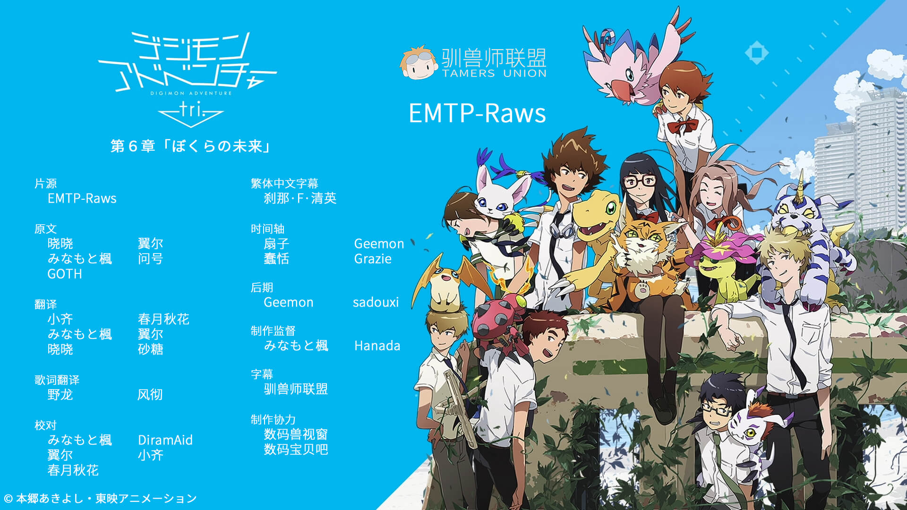

## 数码兽大冒险tri. 第6章「我们的未来」

世界的毁灭开始了。暴走的缅因猫兽吞噬了暗黑进化后的迪路兽，化为拥有强大力量的秩序兽。一切正如世界树所愿，现实世界即将遭到数码世界的吞噬。绝望迫近着，被选召的孩子们仍不后退。没有了太一，现在，只有大和能够代替他。加布兽尽力鼓励着大和，而亚古兽则坚信着太一必定会回来。另一边，为了处理掉已经失控的秩序兽，恒常性想着手执行把现实世界拖下水的最终计划。为了防止世界遭到破坏，孩子们与数码兽搭档还在艰苦卓绝地战斗着。对于孩子们来说，现在是时候作出最后的决断了。被选召的孩子们自己选择的未来，究竟会是……？

字幕所需字体：
- 微软雅黑
- Meiryo
- 方正准圆_GBK
- 等线
- 等线 Light