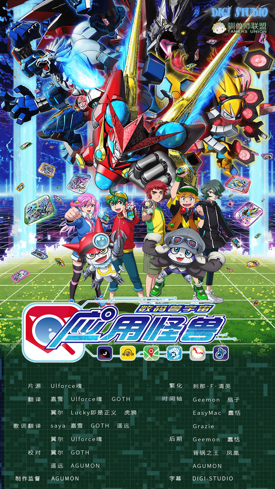

## 数码兽宇宙 应用怪兽

如今，全世界所有人都在使用的智能手机应用。那里潜藏着无人知晓的存在·应用怪兽，通称“应用兽”。应用兽是具备能够自主思考行动的人工智能的应用生命体，在人类世界与数码空间的间隙中，为系统及人类发挥着机能。
但是，潜藏在网络之海中的“凶恶的最终BOSS人工智能·利维坦”化作病毒控制了应用兽们，并开始黑入各个系统，企图从网络一侧控制人类的世界。
主人公少年·新海遥，获得了被伟大的意志引导的“应用驱动”，并使来自“应用芯片”的搜索应用·盖奇兽实体化了。
隐藏在“应用驱动”中的谜团，处在应用兽所潜藏的网络世界与现实世界之间的不可思议的“场”，以及2只应用兽进化的“应用合体”到底是什么？“利维坦”真正的目标究竟是…！？
爱好读书的少年遥，与搜索应用的怪兽·盖奇兽这一对不对称的组合，奔驰于现代世界的新感觉搭档物语，现在启动！

字幕所需字体：
- 微软雅黑
- Meiryo
- 方正准圆_GBK
- 方正楷体_GBK
- 方正行楷_GBK
- 华文中宋
- 黑体